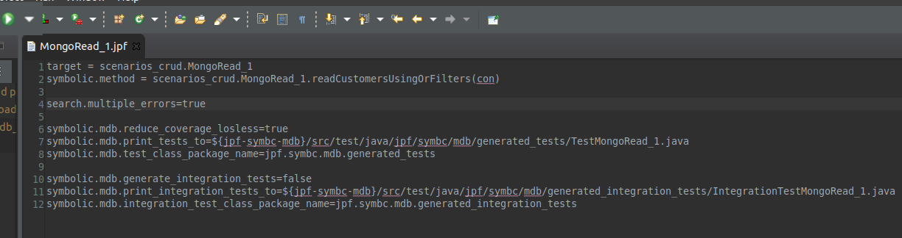

# JaSoN (**Ja**va Pathfinder for **S**ymbolic Execution of **N**oSQL Database Applications), a symbolic mock for NoSQL databases using Symbolic Pathfinder for SAC2021
JaSoN is a project striving to enable the creation of symbolic NoSQL database mocks. This prototype comprises a symbolic mock for MongoDB. JaSoN requires the use of Java 8.
This project contains versions of Java PathFinder ([jpf-core](https://github.com/javapathfinder/jpf-core)) and Symbolic PathFinder ([jpf-symbc](https://github.com/SymbolicPathFinder/jpf-symbc)) adjusted for mocking [MongoDB](https://mongodb.github.io/mongo-java-driver/). For simplicity of configuration, the needed mongodb-related JARs ([bson-3.12.4.jar](https://mvnrepository.com/artifact/org.mongodb/bson/3.12.4), [mongodb-driver-3.12.4.jar](https://mvnrepository.com/artifact/org.mongodb/mongo-java-driver/3.12.4), and [mongodb-driver-core-3.12.4.jar](https://mvnrepository.com/artifact/org.mongodb/mongodb-driver-core/3.12.4)) as well as a [JSON-library](https://mvnrepository.com/artifact/com.googlecode.json-simple/json-simple/1.1.1), all of which are available under Apache 2.0, are also already included in the jpf-symbc-mdb-lib-folder.

It is tested with the [Eclipse](https://www.eclipse.org/) Java IDE which also is the suggested IDE to use. For example run-configurations (see below) only are written for Eclipse. 

To setup Java PathFinder and its extensions you should create a `~/.jpf` folder and store a `site.properties` with the following content in it: 
```
jpf-core = <PATH to superproject>/jpf-core

jpf-symbc = <PATH to superproject>/jpf-symbc

jpf-symbc-mdb = <PATH to superproject>/jpf-symbc-mdb


extensions=${jpf-core},${jpf-symbc},${jpf-symbc-mdb}
```
To setup Symbolic PathFinder with Z3 the "native library location" of com.microsoft.z3.jar within the jpf-symbc project must be set to the location containing the Z3-binary. For example, set it to `/usr/lib/z3-4.8.8-x64-ubuntu-16.04/bin`. Pre-built Z3-binaries can be retrieved [here](https://github.com/Z3Prover/z3/releases). 

To generate tests using jpf-symbc-mdb, we use an Eclipse run-configuration executing JPF-files.
Exemplary JPF-files are located in the jpf-symbc-mdb subproject under `src/examples/scenarios_crud`.


To execute a .jpf file, open the corresponding .jpf file in Eclipse and choose `run-JPF-symbc-mdb` from the selection of run-methods (the scaled bit in the upper left corner of the picture). It is important that you opened/clicked into the .jpf file's content just before executing this run-configuration as elsewise Eclipse might not find the .jpf file. If the run configuration is not yet displayed there, right-click into the .jpf file, `Run as > Java Application > run-JPF-symbc-mdb`.

`jpf-symbc-mdb` comprises the code for mocking as well as the adjusted bytecode. Examples (the methods, test drivers, and .jpf files) are located under `jpf-symbc-mdb/src/examples/scenarios_crud`. The generated integration tests in `jpf-symbc-mdb/src/test/java/generated_integration_tests` still utilize the mock database. For convenience the integration tests which are executed on a real MongoDB instance are located within the `mongo_project` subproject. The content of `mongo_project/src/main/java/scenarios_crud` mirrors the scenarios within `jpf-symbc-mdb`. There are, however, no test drivers and JPF-files, since these are only needed for test case generation. The `jpf-symbc-mdb/src/examples/social_media_app/service` folder comprises the service classes mentioned in the paper. This project again is mirrored by the `mongo_project` subproject.
